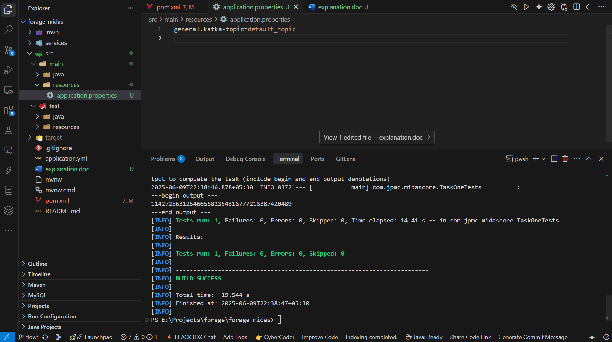

# Midas Core - Task One Setup Explanation

This document outlines the steps taken to set up the Midas Core project environment, add necessary dependencies, and ensure the initial tests pass.

## 1. Project Familiarization and Dependency Management

*   **Reviewed `pom.xml`**: The first step was to examine the project's `pom.xml` file to understand its current Maven configuration and dependencies. It was a standard Spring Boot setup with an empty `<dependencies>` section.
*   **Added Dependencies**: The following dependencies were added to the `pom.xml` file as per the task requirements:
    *   `org.springframework.boot:spring-boot-starter-data-jpa:3.2.5`
    *   `org.springframework.boot:spring-boot-starter-web:3.2.5`
    *   `org.springframework.kafka:spring-kafka:3.1.4`
    *   `com.h2database:h2:2.2.224`
    *   `org.springframework.boot:spring-boot-starter-test:3.2.5` (test scope)
    *   `org.springframework.kafka:spring-kafka-test:3.1.4` (test scope)
    *   `org.testcontainers:kafka:1.19.1` (test scope)
    The `replace_file_content` tool was used to modify the `pom.xml`.

## 2. Troubleshooting Initial Test Execution

*   **First Test Attempt**: An attempt was made to run `TaskOneTests` using the Maven wrapper command:
    ```sh
    .\mvnw.cmd test -Dtest=TaskOneTests
    ```
*   **Test Failure**: The tests failed. The error logs indicated that the Spring application context could not be loaded because it was unable to resolve a placeholder for the property `general.kafka-topic`.
    ```
    Caused by: java.lang.IllegalArgumentException: Could not resolve placeholder 'general.kafka-topic' in value "${general.kafka-topic}"
    ```
*   **Identifying the Root Cause**: Spring Boot applications typically load properties from an `application.properties` or `application.yml` file located in the `src/main/resources` directory. It was determined that this directory and, consequently, the properties file were missing.
*   **Creating Necessary Directory**: The `src/main/resources` directory was created using the command:
    ```sh
    mkdir -p src\main\resources
    ```
    (Note: The `run_command` tool executed this. On Windows PowerShell, an equivalent like `New-Item -ItemType Directory -Path src\main\resources -Force` would achieve the same.)
*   **Creating Configuration File**: An `application.properties` file was created in `e:\Projects\forage\forage-midas\src\main\resources\` with the following content to define the missing property:
    ```properties
    general.kafka-topic=default_topic
    ```
    The `write_to_file` tool was used for this.

## 3. Successful Test Execution

*   **Second Test Attempt**: After creating the `application.properties` file with the required property, the tests were run again using the same command:
    ```sh
    .\mvnw.cmd test -Dtest=TaskOneTests
    ```
*   **Test Success**: This time, the tests passed successfully, and the required output snippet was generated. This output is visually represented in the image below.

### Test Output Snippet

*The image above should display the console output: 1142725631254665682354316777216387420489. If the image is not visible, ensure 'output_snippet.png' is in the same directory as this README file.*

## 4. Summary of Commands Used

*   To run the tests: `.\mvnw.cmd test -Dtest=TaskOneTests`
*   To create the missing resources directory: `mkdir -p src\main\resources`

This setup ensures that the project has the necessary dependencies and basic configuration to proceed with further development tasks.
